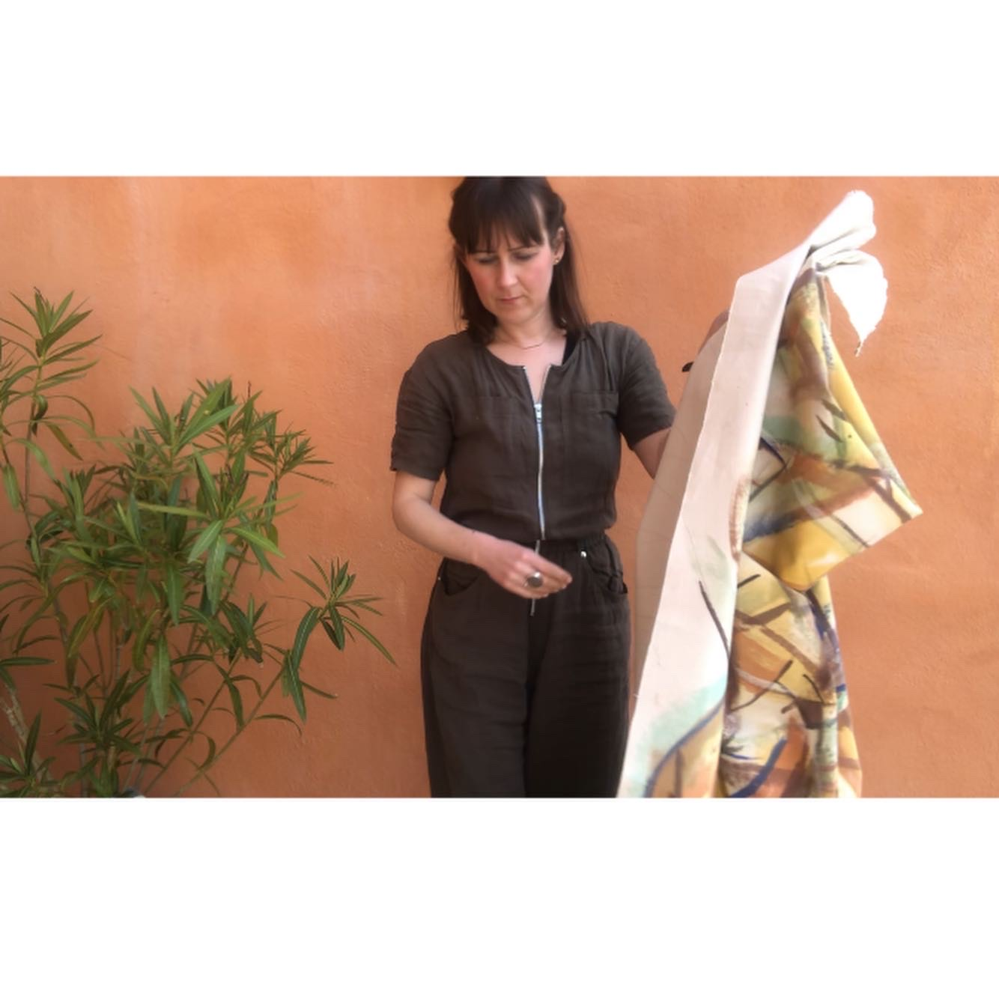

# Artist Statement

Sarah Lawton (1982) is a British artist, born in Lancashire. Since training at the National Institute of Design she made several research trips to India and despite now being based in London she continues to practice embodied drawing and egg tempera. By observing the way in which dynamics are built and conflicts sometimes emerge her artwork meditates on the indelibility of human nature.

Sarah’s work explores routes of integration between self-expression and human shadow aspects. She paints on a large-scale to create patterns derived from reportage drawings made from observation of the body in movement. Lawton is interested in coexistence and interdependence between people and their environment. Her paintings on paper are for conversations that may be difficult to broach and for voices often too quiet to hear. The artworks are informed by “Yantra philosophy” and the dynamics of cosmic unity.

Sarah’s work has been presented at China Academy of Art, Hangzhou, Somerset House, London and Darpana Academy of Art, Ahmedabad; as part of the Vikram Sarabhai International Arts Festival. Her work is held in public and private collections at V&A, Kensington and Chelsea Town Hall and Tate archives. Sarah’s current drawings and paintings explore salutogenic practices.

[@bodysiteknowledge](https://www.instagram.com/bodysiteknowledge)
