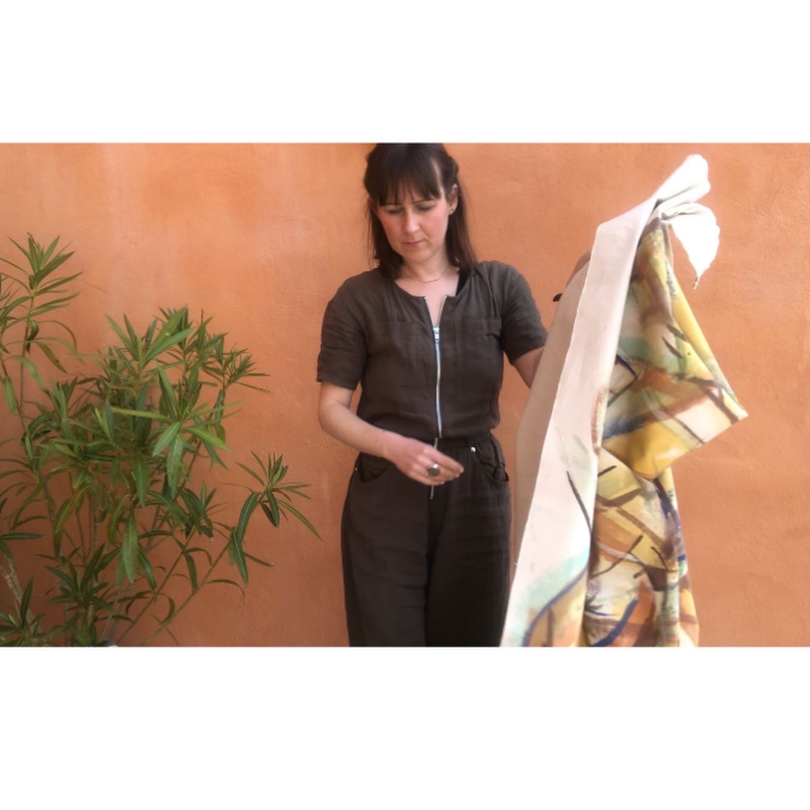

# Artist Statement

Sarah Lawton (b. 1982) is a British artist from Lancashire. Following training in India (2012–2013), she has undertaken several research trips to Darpana Academy of Performing Arts. Now based in London, she continues to develop her practice in embodied drawing and egg tempera painting.
Through close observation of the body in motion, Lawton examines how dynamics are formed and where tensions or challenges arise. Her work meditates on the enduring nature of human behaviour, exploring the integration between self-expression and shadow aspects.

Working at a large scale, she creates intricate patterns derived from reportage drawings made through direct observation of movement. Lawton’s practice reflects a deep interest in coexistence and interdependence between individuals and their environments. Her works on paper aim to open space for conversations that are often difficult to broach, giving form to voices that are frequently unheard.
Informed by Yantra philosophy, her work engages with ideas of cosmic unity, interconnected systems and human connection. 

Lawton has exhibited locally, nationally and internationally, including at China Academy of Art, Kensington New Town Hall (Civic Gallery) in London, and at Darpana Academy of Performing Arts as part of the Vikram Sarabhai International Arts Festival. Her work is held in both public and private collections.
Her current drawings and paintings explore healing practices, drawing on natural forms and traditionally used medicinal plants sourced locally in South West London, where she lives and works. 

*This site and its content are protected by intellectual property rights, including copyright and trade marks. Except as expressly authorised by us or relevant third parties, you agree not to copy, download, adapt, alter, modify, rent, lease, loan, sell, distribute or create derivative works of any content of the site, in whole or in part.

BodySiteKnowledge ® 2026 
